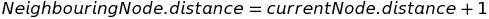
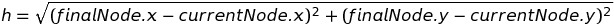
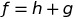

This project was bootstrapped with [Create React App](https://github.com/facebook/create-react-app).

# Path Finder Visualizer
The Path Finder Visualizer is an application that visualizes a path between a start and finish point on a 2 dimensional plane.

The application allows users to move the start and finish node while also allowing users to add and remove walls on the 2-d plane to serve as a barrier for the path.

Currently, 2 algorithms are implemented to find the path, these are:

#

## Dijkstra's Algorithm:
Dijkstra's Algorithm is an algorithm for finding the shortest path between a start and finish node. The algorithm does this by finding the distance of nodes from the starting node.

The algorithm starts by setting the distance of the start node as 0 and its neighbouring nodes as 0+1. The algorithm does this again for the neighbouring nodes and increments the distance using the following formula:

This process is repeated until every node on the plane is visited. However the algorithm will not replace a distance of a node if it can already be reached using a shorter path. Each node stores its previous node and thus the shortest path to the final node can be found by tracing back from the final path to the starting path.

Dijkstra's Algorithm is slow relative to other algorithms such as the A* algorithm.

#

## A* Algorithm
The A* algorithm is another algorithm used to find the shortest path between a start and finish node. The algorithm does this by judging the distance of nodes from the start node and the finish node. 

The algorithm starts by finding the neighbouring nodes to the start node, it assigns a value of 1 to that nodes g variable (distance from start node). the algorithm then calculates the euclidean distance of each node from the finish node, this is the h variable.

Once the h and g values are found for all neighbouring nodes, the algorith calculates f which is simply the sum of h and g. The node with the lowest f is the next node in the path. This is repeated until the final node is reached and the path is found.

#

## How to use the path finder visualizer

The app currently contains 2 algorithms. To choose an algorithm use the drop menu